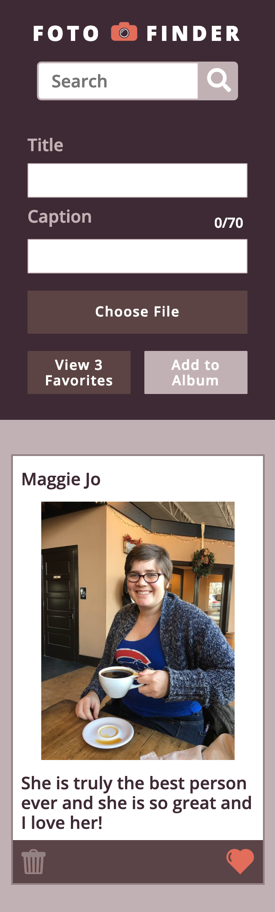

# FotoFiner
FotoFinder can be used to locally store photos. Photos are given a title and caption, and can be favorited, deleted, or changed.

## Motivation:
This project was created as part of the Turing School of Software and Design Module 1, Frontend curriculum. This project is intended to increase the developers knowledge of Javascript, in particular: local storage, DOM manipulation, and object oriented programing. 

## Tech Used:
Built with:
* Javascript
* JSON

## Screenshots:

### Given Version: 

### Desktop Version:

### Mobile Version:

## Credits
FotoFinder was built by:
* [Jacob Bogart](https://github.com/jacobogart)

